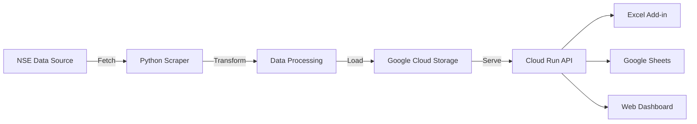

<div align="center">

# 📊 NSE Stock Data Pipeline

**Automated ETL pipeline for National Stock Exchange (NSE) historical price data**


</div>

---

## Overview

A production-grade data pipeline that automates the extraction and transformation of historical stock market data from the National Stock Exchange of India (NSE). Designed for quantitative analysis and powering downstream applications like Excel add-ins, Google Sheets add-ons, and web dashboards.

## Architecture



## Features

- 🔄 **Automated Data Pull** — Scheduled extraction of historical price data from NSE
- 🧹 **Data Transformation** — Cleans, normalizes, and structures raw market data
- ☁️ **Cloud Storage** — Persists processed data to Google Cloud Storage
- 📡 **API-Ready** — Feeds downstream applications via Cloud Run REST APIs
- 📈 **Comprehensive Coverage** — Supports multiple stock symbols and date ranges

## Tech Stack

| Component | Technology |
|-----------|-----------|
| Language | Python |
| Cloud | Google Cloud Platform |
| Storage | Google Cloud Storage |
| Compute | Google Cloud Run |
| Data Source | NSE India |

## Getting Started

### Prerequisites
- Python 3.9+
- Google Cloud SDK
- GCP service account with Cloud Storage access

### Installation

```bash
# Clone the repository
git clone https://github.com/SuminPillai/nse-stock-data-pipeline.git
cd nse-stock-data-pipeline

# Install dependencies
pip install -r requirements.txt

# Configure GCP credentials
export GOOGLE_APPLICATION_CREDENTIALS="path/to/service-account.json"

# Run the pipeline
python main.py
```

## Related Projects

- [**StockData Excel Add-in**](https://github.com/SuminPillai/stockdata-excel-addin) — Excel task pane for stock data access
- [**StockData Google Sheets Add-on**](https://github.com/SuminPillai/stockdata-google-sheets-addon) — Google Sheets sidebar for financial analysis
- [**StockData WebApp**](https://github.com/SuminPillai/stockdata-webapp) — Web interface for data visualization

---

<div align="center">
  <p>Built with ❤️ by <a href="https://github.com/SuminPillai">Sumin Pillai</a> · <a href="https://alphaquantixanalytics.com">AlphaQuantix Analytics</a></p>
</div>
